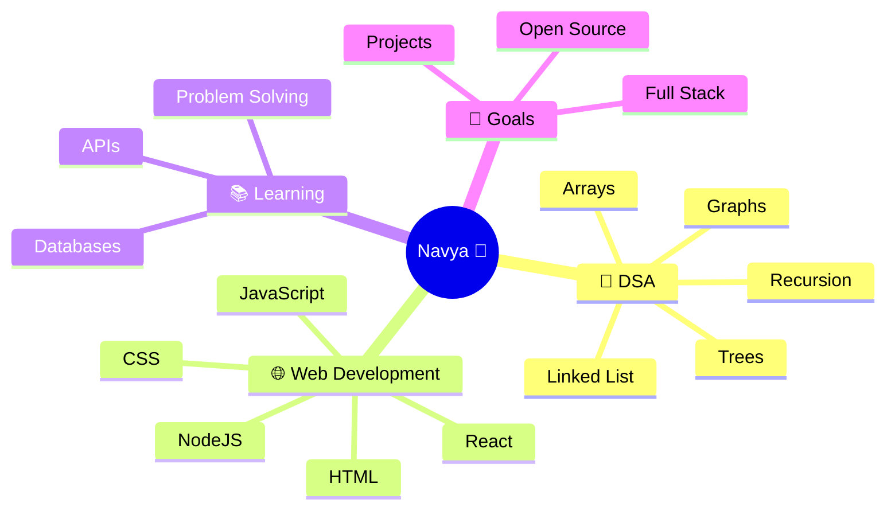

<!-- Animated Header -->
<h1 align="center">
  
</h1>

<h3 align="center">🌙 Code • Create • Learn • Grow 🚀</h3>

---

# 👩‍💻 About Me

<table>
<tr>
<td align="center">

🎓 **B.Tech Computer Science & Engineering Student**  
🏫 AKTU University College  

💡 Passionate about **Full Stack Development** & **Problem Solving**  

🌱 Currently Learning  
☕ Java • 🧠 DSA • ⚛️ React • 🌐 Web Development  

⚡ Current Focus  
🚀 Building Projects • 💻 Improving Coding Skills  
📚 Learning Modern Web Technologies  

🎯 Goals  
✨ Become a Skilled Full Stack Developer  
🌍 Build Real-World Projects  
🤝 Contribute to Open Source  

📚 Additional Skills  
🔹 Git & GitHub  
🔹 Responsive Design  
🔹 APIs & Databases  
🔹 Team Collaboration  
🔹 Debugging & Optimization  

</td>
</tr>
</table>

---

# 🚀 Projects

<table>
<tr>

<td width="50%">

## 📝 ToDo Flow

✨ A clean and responsive task management web app to organize daily activities efficiently.

### 🔹 Features
✅ Add & Delete Tasks  
✅ Mark Tasks as Completed  
✅ Responsive UI  
✅ Clean & Modern Design  

### 🛠️ Tech Used
🌐 HTML • 🎨 CSS • ⚡ JavaScript • ⚛️ React

🔗 **Project Link**  
[🚀 ToDo Flow Repository](https://github.com/navyaa-sh28)

</td>

<td width="50%">

## 🍴 Velvet Spoon

✨ A modern restaurant & food ordering website with elegant UI and responsive layouts.

### 🔹 Features
✅ Beautiful Landing Page  
✅ Responsive Design  
✅ Interactive Sections  
✅ Smooth Navigation  

### 🛠️ Tech Used
🌐 HTML • 🎨 CSS • ⚡ JavaScript • 🅱️ Bootstrap

🔗 **Project Link**  
[🚀 Velvet Spoon Repository](https://github.com/navyaa-sh28)

</td>

</tr>
</table>

---

# 🌌 Tech Stack

### 💻 Programming Languages

### 🌐 Frontend Development

### ⚙️ Backend & Databases

### 🛠️ Tools & Platforms

---

# 📊 GitHub Analytics

---

# 🔥 GitHub Streak

---

# 📈 Contribution Graph

---

# 🌟 Current Focus

---

# 🧠 Coding Journey

📌 Solving problems regularly on **LeetCode, CodeChef & GeeksforGeeks**  
📌 Building projects to improve practical development skills  
📌 Exploring modern frontend & backend technologies  
📌 Learning clean code practices & optimization techniques  
📌 Practicing consistency and logical thinking daily 🚀  

---

# ✨ Beyond Code

💃 Dancing  
📚 Reading Books  
✈️ Travelling & Exploring  
🎵 Music & Creativity  
☕ Late Night Coding Sessions  
🌸 Learning New Things Everyday  

---

# 🌐 Connect With Me

---

<h3 align="center">
⭐ Thanks for visiting my profile ⭐
</h3>
